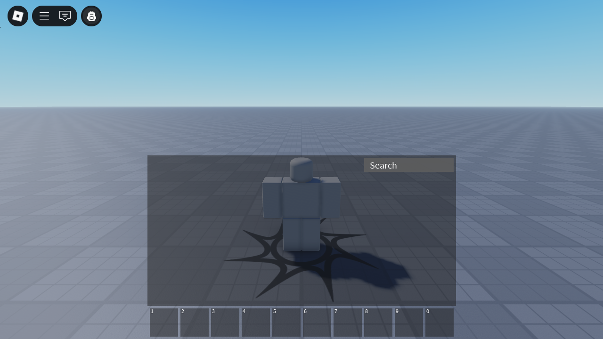

<h1 align="center">
  
   
  Purse
</h1>

  
  
  

Purse is a fork of the [default Roblox backpack](https://github.com/MaximumADHD/Roblox-Client-Tracker/blob/roblox/scripts/CoreScripts/Modules/BackpackScript.lua) which is decoupled from the CoreGui, allowing developers access to APIs that were previously unavailable and allowing for code modifications.

For more information, see the [documentation](https://purse.luau.page/).
