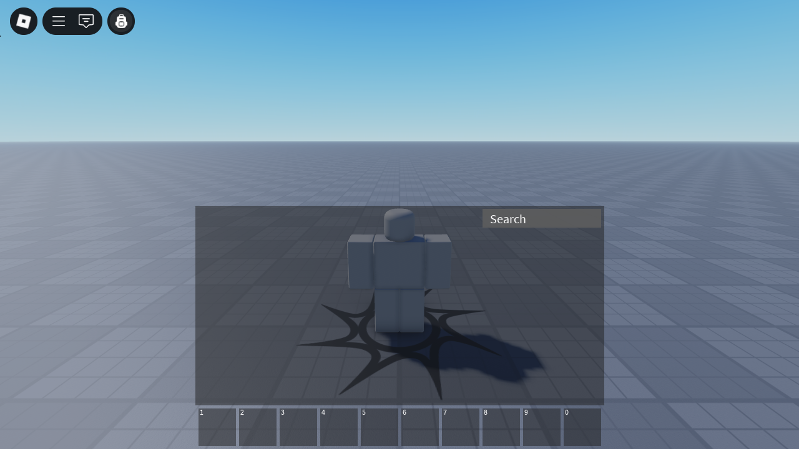

# Purse

> [!CAUTION]
> Purse is in very early development and is not ready for production use. It is not recommended to use this in any experiences at this time.

Purse is a fork of the default Roblox backpack which is decoupled from the CoreGui, allowing creators access to APIs that were previously unavailable and allowing for code modifications.

