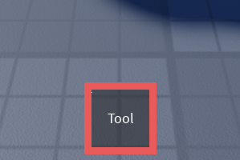

Through source code modifications, you can change Purse's behavior and appearance. Here are a few examples of what you can do with Purse.

## Changing Equip Color

You can make the slot's equip color which is blue, by changing the `SLOT_EQUIP_COLOR` constant in it's source.

This code sample changes the equip color to red.

``` lua linenums="44" hl_lines="2"
--8<-- "src/init.luau:44:44"
local SLOT_EQUIP_COLOR = Color3.new(233 / 255, 90 / 255, 90 / 255) -- (1)!
--8<-- "src/init.luau:46:49"
```

1.  Changed from blue `#!lua Color3.new(90 / 255, 142 / 255, 233 / 255)` to red `#!lua Color3.new(90 / 255, 142 / 255, 233 / 255)`


